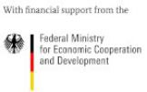

# installing-solar-system-at-pagirinya-satelite-space
This is an innitiative by Agency for culture and critical transformation (R0g) to Access to skills and knowledge network (#ASKnet) to The Youth Empowerment Foundation (YEF)to overcome the over welming power problems facing the activities of the refugee Youths in pagirinya refugee settlement.

The R0g - agency (pronounced: rogue) is a Berlin based non profit dedicated to partnering with local grassroot communities, organizations and government to support open knowledge, open technology and peace building.

For more on R0g open the [link](https://openculture.agency/)

## Activities of The Youth Empowerment Foundation (YEF)
- Digital literacy
- media skills
- Training skills (hardware and repair)
- podcasts
For more about YEF activities, open the link
[Activities](https://yef-uganda.org/)

# components in the power kit.
- The kit comprises of the following items:
## 1.Powder batteries

- 2pieces
- 30by 13each
- 12volts
- 200AH
- charge current max of 30A
- with a floating voltage of 13.38volts
- terminal hardware torquo of 9~12
## 2.solar panels

- 2pieces
- 204 by 100
- 415watts each
- 40.70voltage each
- for more about the solar panels,read the manual on the picture bellow.

## 3.solar frame
- 204 by 200
- Designed with locks at every corner
## 4.battery frame
- 30 by 26
## 5.Digital power inverter

- 3000volt amps
- output voltage 230v
- comes with a watch disk,it's functionality can be monitored on the computer
## Tools and equipments used during installation
- Electric drill

- Grinder
- welding transformer

- welding generator
- power cable

- weldering rod
## Step by step procedure for installation.
## partners and funders
|BMZ|R0g Agency|   ASKnet    |YEF|
|---|-------------|---------|-------| 
|||||

