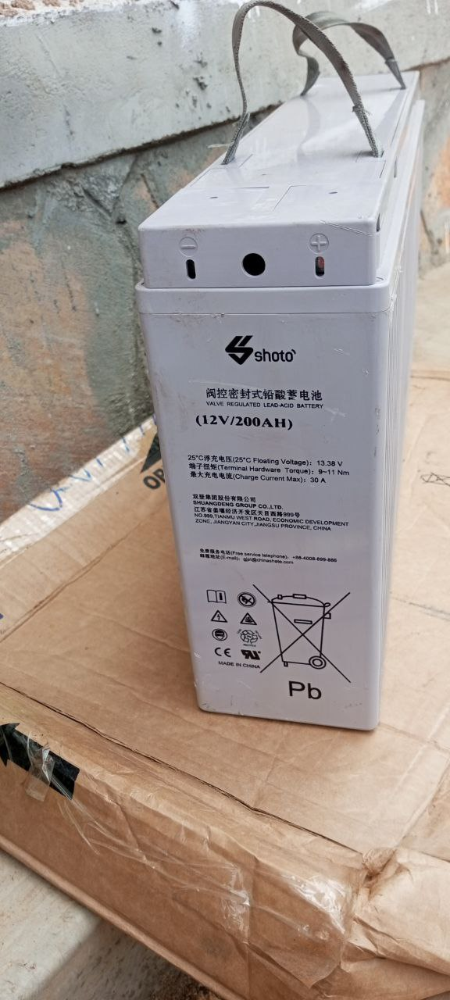
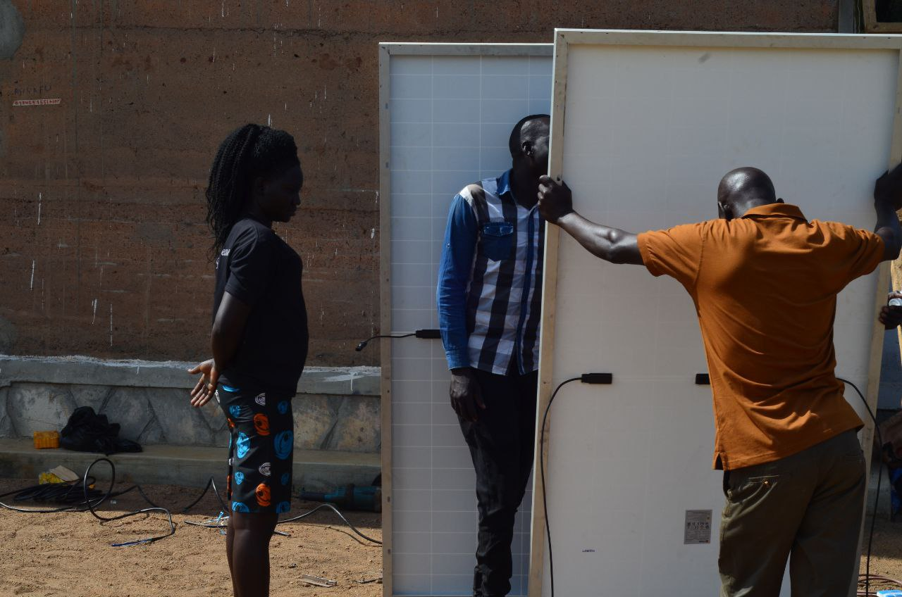
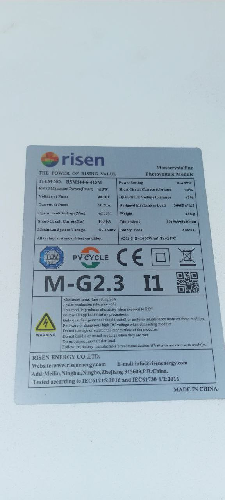
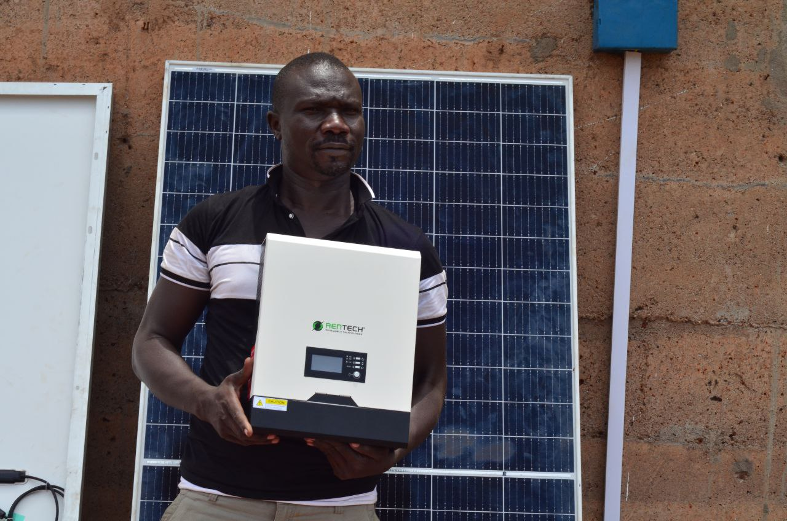
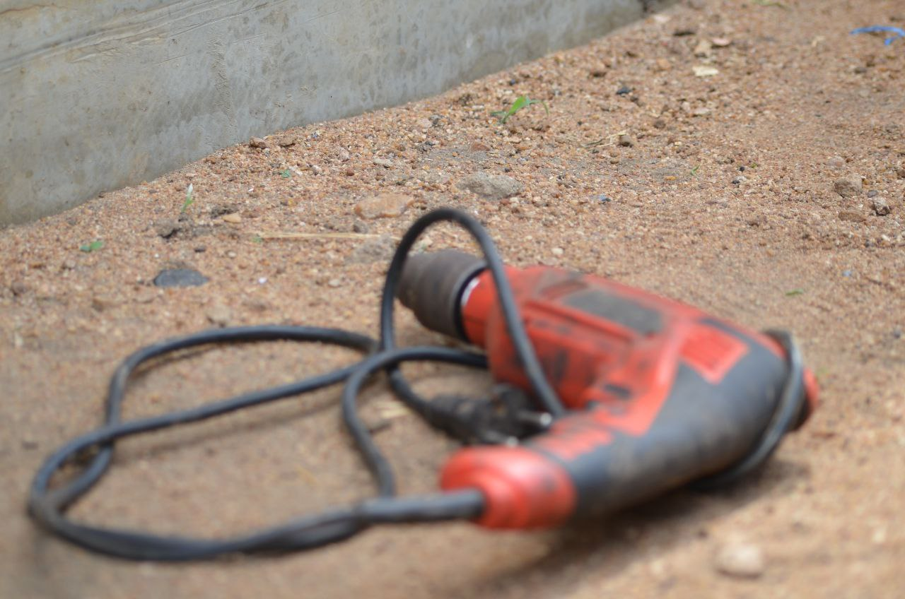
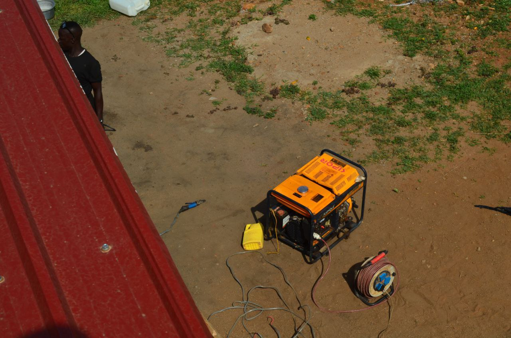

# installing-solar-system-at-pagirinya-satelite-space
This is an innitiative by R0g to Access to skills network to The Youth Empowerment Foundation (YEF)to overcome the over welming power problems facing the activities of the refugee Youths in pagirinya refugee settlement.

# 1.Powder batteries

- 2pieces
- 30by 13each
- 12volts
- 200AH
- charge current max of 30A
- with a floating voltage of 13.38volts
- terminal hardware torquo of 9~12
# 2.solar panels

- 2pieces
- 204 by 100
- 415watts each
- 40.70voltage each
- for more about the solar panels,read the manual on the picture bellow.

# 3.solar frame
- 204 by 200
- Designed with locks at every corner
# 4.battery frame
- 30 by 26
# 5.Digital power inverter

- 3000volt amps
- output voltage 230v
- comes with a watch disk,it's functionality can be monitored on the computer
# Tools and equipments used during installation
- Electric drill

- Grinder
- welding transformer

- welding generator
- power cable

- weldering rod
# Step by step procedure for installation.
# partners

